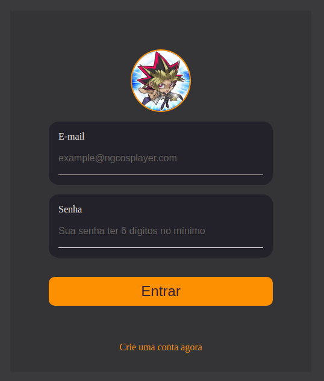
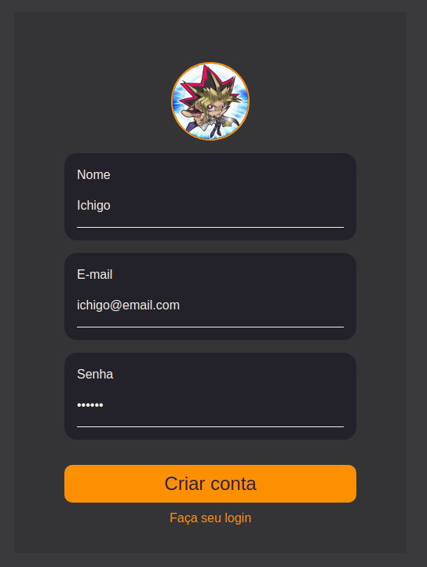
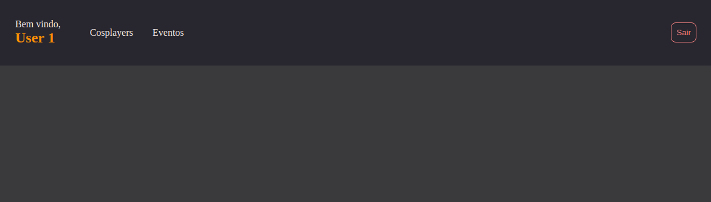
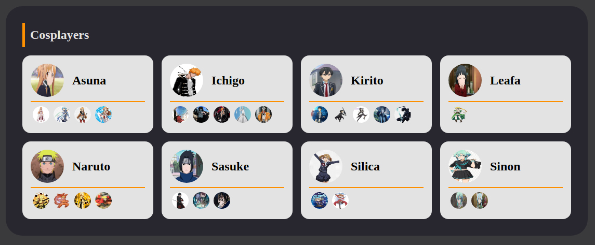
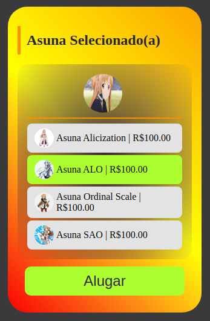
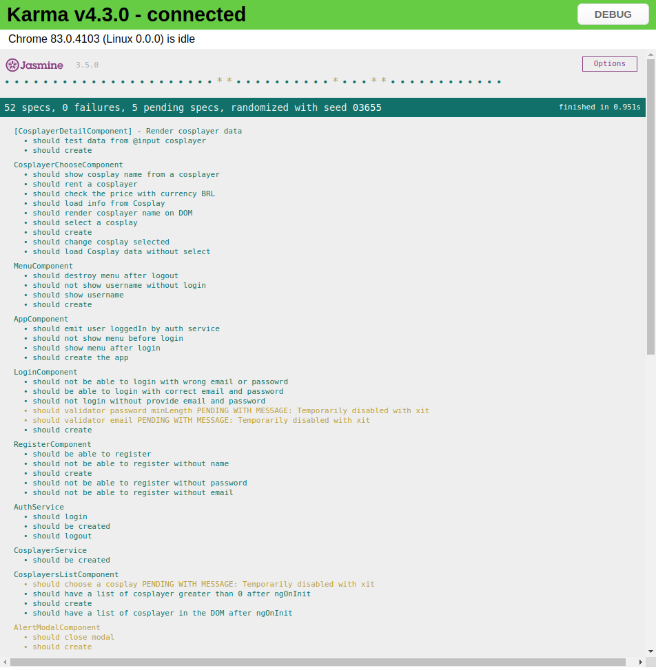
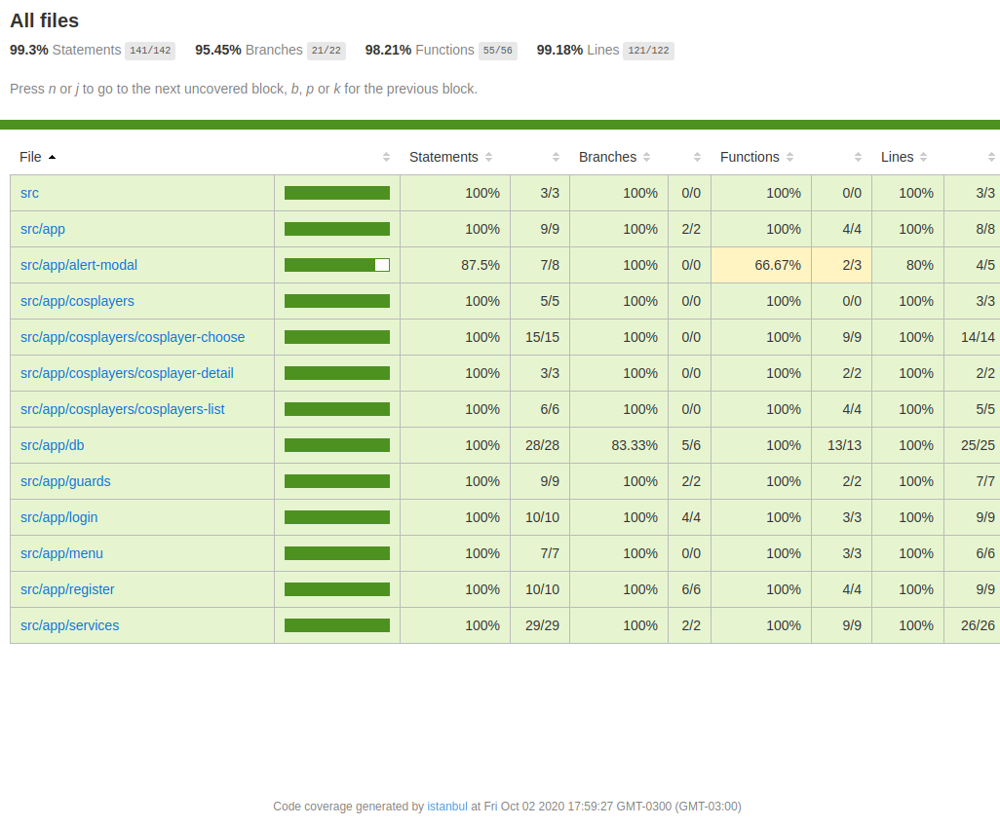

# Ng-Cosplay

Aplicação Web para conectar eventos e cosplayers. Os cosplayers disponibilizam seus dados na plataforma para serem encontrados e contratados para festivais por organizadores.

## Como fazer login ⚠️

Para fazer login na aplicação com o usuário já existente, utilize o **e-mail** `user01@email.com` e **senha** `123456`.

> Também é possível criar conta na página de registro

## Mostrando a aplicação

  

## Construindo ⚠️ ⚒️

### Login

  

### Registro

  

### Menu

  

### Listagem de Cosplayers

  

### Cosplayer Escolhido

  

---

## Jasmine/Karma 🧪

  

## Coverage 🧪

  

