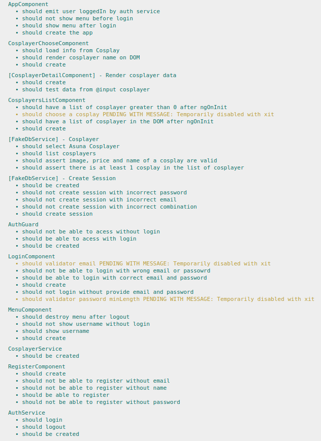
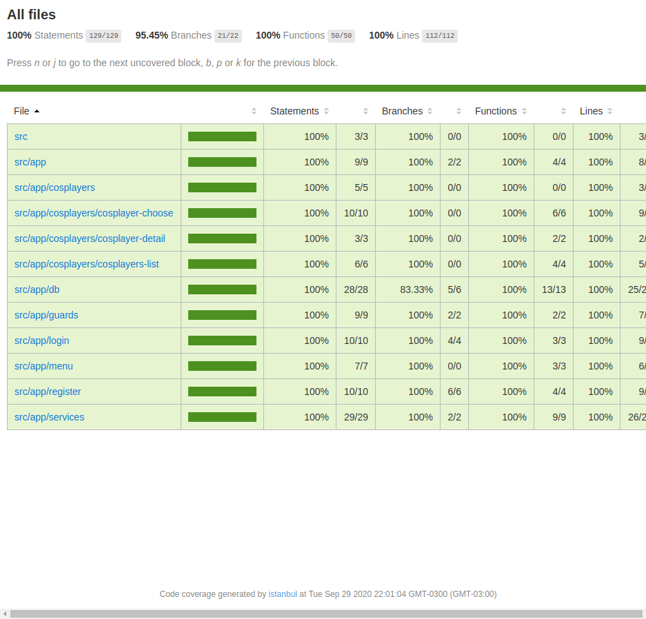

# Ng-Cosplay

Aplicação Web para conectar eventos e cosplayers. Os cosplayers disponibilizam seus dados na plataforma para serem encontrados e contratados para festivais por organizadores.

## Construindo ⚠️ ⚒️

### Login

  

### Menu

  

### Listagem de Cosplayers

  

### Cosplayer Escolhido

  

---

## Jasmine/Karma 🧪

  

## Coverage 🧪

  

